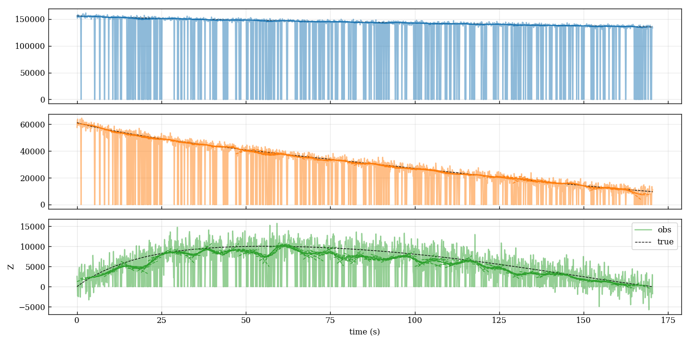

# ADMM-Based Trajectory Reconstruction Pipeline



> 6-DOF 비행체(미사일·UAV 등) 궤적을 시뮬레이션하고  
> 노이즈·결손 구간이 있는 데이터를 **ADMM** 으로 복원합니다.

---

## ✨ 주요 기능
- Monte Carlo 기반 비행 궤적 생성
- 가우시안 노이즈 + 결손 구간 데이터 생성
- **ADMM** 슬라이딩 윈도우 복원
- RMSE / MAE / Max Error 지표 계산 & 시각화

## 🛠️ 요구 사항
- **Python ≥ 3.8**
- 의존성: `requirements.txt` 참조

## ⚡ 설치
```bash
# 1) 가상 환경 생성
python -m venv venv
# Windows
venv\Scripts\activate
# macOS/Linux
source venv/bin/activate

# 2) 패키지 설치
python -m pip install --upgrade pip
pip install -r requirements.txt

Jinwoo Im (`imrealhelper`)  
Inha University, Dept. of Aerospace Engineering

---
